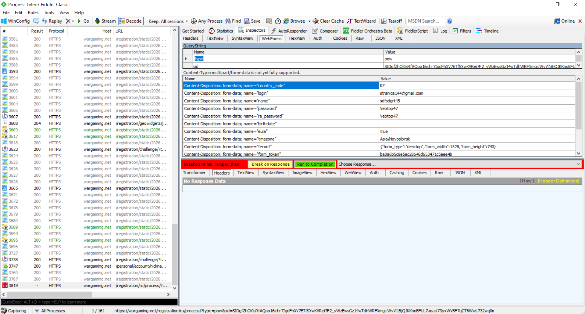
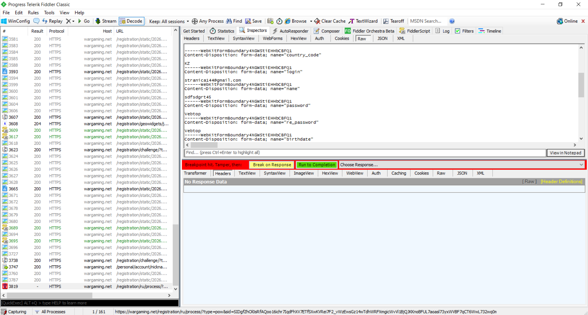
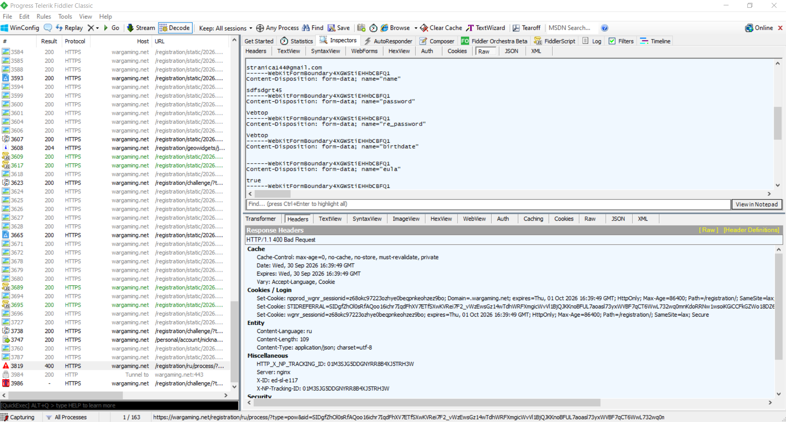

# Тестирование серверной валидации с помощью Fiddler Classic

**Цель теста:** Проверить, что сервер производит повторную проверку (валидацию) данных, предотвращая регистрацию пользователей с некорректными данными в обход интерфейса.

## 📝 Сценарий тестирования (Тест-кейс)

*   **Предусловие:** В Fiddler Classic включен точечный перехват запросов (команда `bpu registration`).
*   **Шаги выполнения:**
    1. Открыть форму регистрации World of Tanks в браузере.
    2. Заполнить все поля валидными данными, соответствующими ТЗ.
    3. Нажать кнопку отправки формы.
    4. В Fiddler перехватить отправленный POST-запрос.
    5. Перейти на вкладку **Inspectors -> Raw** (или WebForms) и изменить данные в поле passwrod и re_password на невалидные.
    6. Нажать кнопку **Run to Completion** для отправки измененного запроса на сервер.

---

## 📷 Подтверждение выполнения (Артефакты тестирования)

### Шаг 1. Перехват оригинального запроса
На скриншоте ниже зафиксирован момент, когда запрос от браузера успешно перехвачен Fiddler и поставлен на паузу:

### Шаг 2. Модификация данных в теле запроса (Тестирование безопасности)
Здесь показан процесс изменения данных во вкладке Raw. Валидный пароль изменен на невалидный, нарушая требования ТЗ:

### Шаг 3. Верификация ответа сервера
После отправки измененного запроса проверяем реакцию бэкенда. Сервер успешно отклонил запрос и вернул ошибку валидации полей:

---

